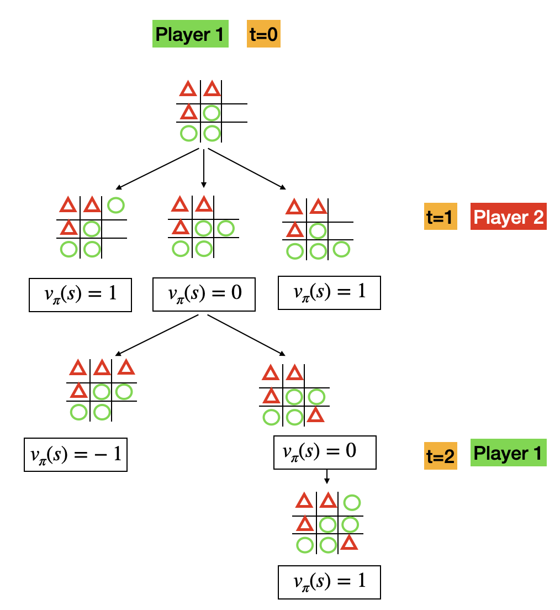
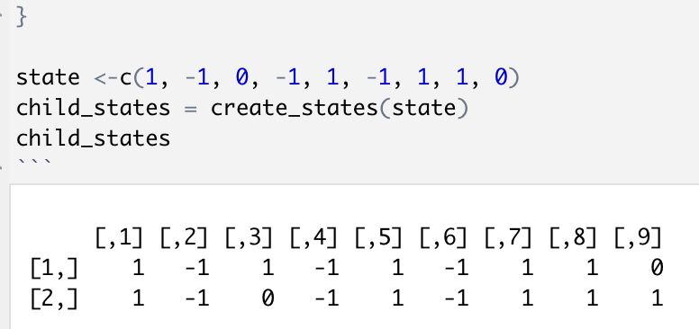
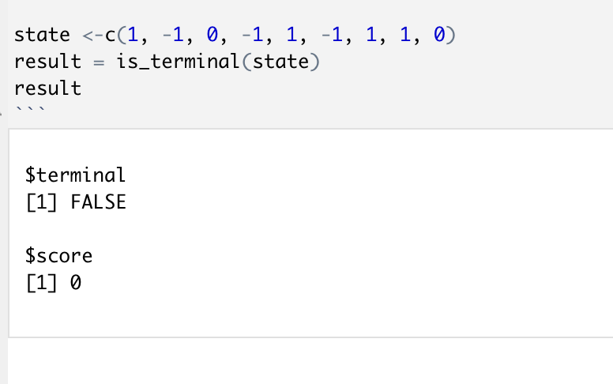

```{r setup, include=FALSE}

# Packes required for subsequent analysis. P_load ensures these will be installed and loaded. 
if (!require("pacman")) install.packages("pacman")
pacman::p_load(tidyverse,
               ggplot2,
               devtools,
               contextual,
               knitr
               )
```

This problem set will consists of two parts
\begin{enumerate}
  \item We will discuss Markov Decision Processes (MDP) . 
  \item We will discuss an example of an MDP, the game tic tac toe, and write an algorithm that can perform the game.
\end{enumerate}

## Markov Decision Processes

\textbf{Setting}: we consider a setting where there is an agent that at moment $t$ choose an action $A_t$ from a set of actions $a \in \mathcal{A}$. The goal of the agent is to maximize the long-term reward, with the reward at $t$ denoted as $r_t$. This is the setting that we have also considered in previous tutorials, but now we add one additional piece of information; the agent is in a certain state $S_t$ from all possible states $s \in \mathcal{S}$. 

We also assume that this is decision process is \textit{Markov}. This means each probability for a subsequent state $S_{t+1}$ and its accompanying reward $r_{t+1}$ only depends on preceding state and action, $S_t$ and $A_t$. This probability is denoted as  $p(S_{t+1}|s,a)$. 


\textbf{Goal}: In order to know what action to take, we try to learn a \textit{policy}; this is simply which action the agent should take, given the state $s$. A policy denoted as $\pi(a |s) = p(A_t = a | S_t = s)$, e.g. the probability that at $t$ an action is $a$ given the state $s$. When an agent in state $S_t$ takes an action $A_t$ as described by policy $\pi$, it transitions to a new state $S_{t+1}$ and a reward $r_{t+1}$. This create a trajectory, where the agent observes:
\begin{align*}
  S_0, A_0, R_1, S_1, A_1, R_2, ...
\end{align*}
Our goal is to maximize our long-term reward. Each reward from the future is discounted by a factor $\gamma$. This long-term reward can be described as:

\begin{align*}
  G_t &= r_{t+1} + \sum^{\inf}_{k=0} \gamma^k r_{t + k + 1} \\
      &= r_{t+1} + G_{t+1}
\end{align*}


\textbf{What is the best policy?} we determine this with help of two functions. First, the state-value function gives us the expected return from a policy $\pi$ when starting in state $s$:
\begin{align*}
  v_{\pi}(s) &= \mathrm{E}[G_t | s] \\
  &=  \mathrm{E}[r_{t+1} + G_{t+1} | s]\\
\end{align*}

The second function is the action-value function, which gives us the value of taking action $a$ in state $s$ under policy $\pi$ and following that policy afterwards:

\begin{align*}
  q_{\pi}(s, a) &= \mathrm{E}[G_t |a, s]\\
  &=  \mathrm{E}[r_{t+1} + G_{t+1} |a, s]\\
\end{align*}


# Tic Tac Toe

The game tic tac toe can be modelled as a markov decision process, just like the example we just discussed - see the example below. The state $s$ in this case is the board, and the action $a$ is putting either a circle or triangle on an open position of the board. If you win the game, the reward $r_t = 1$, a loss means $r_t = -1$, and when there is no winner the reward is $r_t = 0$.


The idea is visualized below:

```{r, echo=FALSE, fig.pos="H", fig.align="center",out.width="50%"}

```


In order to write an algorithm that can play this game, we need several functions:
\begin{enumerate}
  \item A function that based on a state $s$, calculates all the possible states for the next moment $t$. 
  \item A function that evaluates the state $s$: has the game ended, and if yes who won?
  \item A maximizer and minimzer function, which can be used to decide the best move given a state $s$.
\end{enumerate}


Let's first introduce how the states are recorded. Each state is represented as a vector of 9 elements. The 1 indicates a tile for player 1, the -1 for player 2. 0 indicates no tile has been played

```{r}
# each state is represented as a vector of 9 elements.
state <-c(1, -1, 0, -1, 1, -1, 1, 1, -1) 


state_to_board <- function(state){
  # return matrix version 
  board <- t(matrix(state, nrow = 3))
  
  return(board)
}

state_to_board_viz <- function(state){
  board <- state_to_board(state)
  # 1 is for 0
  board[board==-1] = 'o'
  
  # -1 is for x
  board[board==1] = 'x'
  
  # 0 means open
  board[board==0] = '-'
  return(board)
}

# visualize the board
state_to_board_viz(state)
```


\textbf{Step 1:} write function that based on a state $s$, calculates all the possible states for the next moment $t$. Your function should fulfill the following requirements:

\begin{itemize}
  \item It should take the state as an argument
  \item If the number of tiles played is uneven, then player 1 will put the next tile. Otherwise, player 2 will put down the next tile. 
  \item It should return a matrix with each row representing possible future states. For an example of the output, see below. 
\end{itemize}

```{r, echo=FALSE, fig.pos="H", fig.align="center",out.width="50%"}

```


```{r, eval=F, echo=T}
# function that returns the states as a matrix,
create_states<- function(state){
  
    #TODO: write function in line with description of step 1

  
  
}

# to check if correct
state <-c(1, -1, 0, -1, 1, -1, 1, 1, 0)
create_states(state)

```


\textbf{Step 2:} write a function that evaluates the state $s$: has the game ended, and if yes who won? There are a couple of requirements:
\begin{itemize}
  \item It should take the state as an argument
  \item It should return a list with two items; \textbf{terminal} is a boolean that tells if the game has ended, and \textbf{score} is an integer that contains a 1, 0 or -1 value based on the result of the game. A value of 1 means that the maximizer has won, -1 that the minimizer has won, and 0 means that there is no result yet. For an example, see below. 
\end{itemize}

```{r, echo=FALSE, fig.pos="H", fig.align="center",out.width="50%"}

```

```{r, eval=F, echo=T}


is_terminal <- function(state, players=c(1, -1), scores = c(1, -1)){
  
  #TODO: write function in line with description of step 2
}


# to check if correct
state <-c(1, -1, 0, -1, 1, -1, 1, 1, 0)
is_terminal(state)

```

\textbf{Step 3}: write a maximizer and a minimizer function. These work recursively. In general, recursion means: when something is defined in terms of itself. In this case, recursion means that the function \textit{mazimize} calls the \textit{minimize} function, and that the \textit{minimize} also calls the \textit{mazimize} function. Your goal is to code:

\begin{itemize}
  \item For the \textit{maximize} function; which action it should take?
  \item For the \textit{minimize} function; which action it should take?
\end{itemize}

```{r, eval=F, echo=T}


# given a state, and a minimizer, what is the maximizing option?
maximize <- function(state){
  
  # check based on state if it is terminal
  result <- is_terminal(state)
  
  # if terminal, return result
  if(result$terminal){

    return(result)
    
  }
  max_state= NA
  max_score=-Inf
  
  # fill in all the possible states 
  max_states  # TODO: add here the states that are maximizing (hint; can be multiple)
  
  # create new states
  children = create_states(state)
  
  # go over each potential state
  for(i in seq(nrow(children))){
    
    # select state
    child = children[i, ]
    
    # what would the minimizer do?
    # TODO: add the result from the minimizer, 
    
    # TODO: get the score based on choice of minimizer
    
    # TODO: if the state is maxiziming, add to max_states
  }
  # if multiple max_states, sample random
  sampled_state <- sample(nrow(max_states), 1)
  max_state = max_states[sampled_state, ]
  
  # return the state and score
  result <- list(state = max_state, score = max_score)


  return(result)
  

}

# given a state, and a maximizer, what is the minimizing option?
minimize <- function(state){
  
  # check based on state if it is terminal
  result <- is_terminal(state)
  
  # if terminal, return result
  if(result$terminal){
    return(result)
    
  }
  min_state= NA
  min_score=Inf
  
  # fill in all the possible states 
  min_states # TODO: add here the states that are minimizing (hint; can be multiple)
  
  # create new states
  children = create_states(state)
  
  # go over each potential state
  for(i in seq(nrow(children))){
    
    # select state
    child = children[i, ]
    
    # what would the maximizer do?
    # TODO: add the result from the maximizer, 
    
    # TODO: get the score based on choice of maximizer
    
    # TODO: if the state is maxiziming, add to min_states
  }
  
  # if multiple, sample random
  sampled_state <- sample(nrow(min_states), 1)
  min_state = min_states[sampled_state, ]

  result <- list(state = min_state, score = min_score)

  
  return(result)
}


```

Now let's check if you have written the functions correctly. If all works well, the function should tell you to put a cross in the top right corner. 
```{r, eval=F}


# what is the optimal decision, given a state?
optimal_decision <- function(state,player = 'Maximizer'){
  if(player == 'Maximizer'){
    result = maximize(state) 
  }else if (player=='Minimizer'){
    result = minimize(state)
  }
  return(result)
}


state_start <- c(1, 1, 0, 1, -1, 0, -1, -1, 0)
print('State at start')
state_to_board_viz(state_start)

decision <- optimal_decision(state_start, player='Maximizer')
print('Optimal decision:')

state_to_board_viz(decision$state)

```