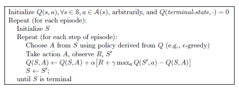
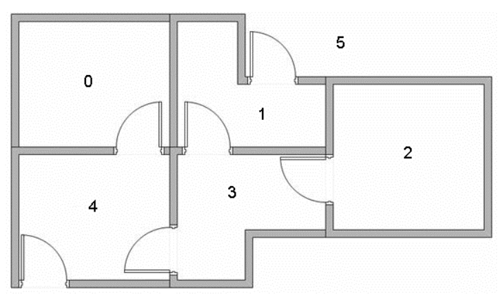
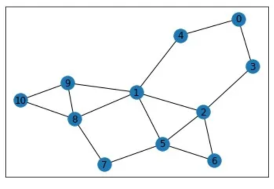

```{r setup, include=FALSE}

# Packes required for subsequent analysis. P_load ensures these will be installed and loaded. 
if (!require("pacman")) install.packages("pacman")
pacman::p_load(tidyverse,
               ggplot2,
               devtools,
               knitr
               )
```

This problem set consists of two parts

```{=tex}
\begin{enumerate}
  \item We will discuss Q-learning. 
  \item We will write an algorithm for an agent that uses Q-learning to learn (i) to find the exit in a building, and (ii) to find the shortest path between nodes.
\end{enumerate}
```
## Q Learning

Consider the setting of Markov Decision Processes of previous tutorial,
where the state-value function is given by \begin{align*}
\nu_{\pi}(s) &= E_{\pi}(G_t|S_t=s)\\
&= E_{\pi}(R_{t+1} + \gamma \nu_{\pi}(S_{t+1})|S_t=s),
\end{align*} where the Temporal Differencing (TD) method uses an
estimate of the latter expression as a target. In particular, the TD
method samples the expected values and it uses the current estimate $V$
instead of true $\nu_{\pi}$.

The TD$(0)$ method update is as follows: for action $A$ given by policy
$\pi$ in state $S$, observe reward $R$ and next state $S'$, and update
\begin{align*}
V(S) \leftarrow V(S) + \alpha\left(R + \gamma V(S') - v(S)\right)
\end{align*} However, we are often interested in the action-value
function, that is, in estimating $q_{\pi}(s,a)$ for all $(s,a)$. We can
do this using the same TD method as described above. \begin{align*}
Q(S,A) \leftarrow Q(S,A) + \alpha\left(R+\gamma Q(S',A')-Q(S,A)\right).
\end{align*} The groundbreaking idea behind Q-learning is to directly
approximate the optimal action-value function, independent of the
policy. The algorithm for Q-learning is given below (see Sutton and
Barto, 2007). Note the difference between the update step for Q-learning
and the TD method.

```{r, echo=FALSE, fig.pos="H", fig.align="center",out.width="70%"}

```

## Code: Path-Finding

In this example, we are using Q-learning to find the optimal route from
a given room to outside. As an illustration, let's take a look at the
figure below.

```{r, echo=FALSE, fig.pos="H", fig.align='center', out.width="70%"}

```

Suppose we want to know what is the best way to get from Room 2 to Room
5 (outside). We need to provide information to the agent what the
rewards or penalties are for attempting to go from one room (state) to
another room (state). We do so using a reward matrix $R$.

```{=tex}
\begin{align*}
R_{ij} = \begin{cases} -1, \quad \text{if you can not go from $i$ to $j$,}\\
                        0, \quad \text{if destination $j$ is not the target state,}\\
                        100, \quad \text{if destination $j$ is the target state.}\end{cases}
\end{align*}
```
For the example above, the reward matrix is specified below.

```{r}
mR <- t(matrix(c(-1, -1, -1, -1, 0, 1,
       -1, -1, -1, 0, -1, 0,
       -1, -1, -1, 0, -1, -1, 
       -1, 0, 0, -1, 0, -1,
        0, -1, -1, 0, -1, 0,
       -1, 100, -1, -1, 100, 100), nrow=6, ncol=6, byrow=TRUE))
```

\textbf{Task 1}: write a Q-learning algorithm that learns the Q matrix
for a given reward matrix $R$.

```{r, eval=F}
####
# q_learning : learn Q matrix using Q-learning algorithm
#
# Arguments : 
#   mR : matrix, reward matrix
#   iNepisodes : integer, number of episodes
#   dAlpha : float, learning rate
#   dGamma : float, discount factor
#   iTargetState : integer, target state of the problem
#
# Output :
# mQ_norm : matrix, normalized Q matrix


q_learning <- function(mR, iNepisodes, dAlpha, dGamma, iTargetState) {
  # initialize Q matrix
  mQ <- matrix(rep(0,length(mR)), nrow=nrow(mR))
  
  # loop over episodes
  for (i in 1:iNepisodes) {
    # for each episode, choose an initial state at random
    current_state <- sample(1:nrow(mR), 1)
    
    ## iterate until we get to the iTargetState
    while (1) {
      
      ## TO DO
      # choose next state from possible actions at current state
      
      ## TO DO
      # if only one possible action, then choose it; otherwise, choose at random
      
      ## TO DO
      # update Q value
      
      # break out of while loop if target state is reached
      if (next_state == iTargetState) break
      
      # otherwise, set next state as current state and repeat
      current_state <- next_state
    }
    
  }
  
  # normalize Q by max value
  mQ_norm <- 100*mQ/max(mQ)
  
  # return
  results <- list(Q=mQ_norm)
  return(results)
}

```

\textbf{Task 2}: find the optimal paths for target state 6. Interpret
the Q-matrix.

```{r, eval=F}
## TO DO

```

## Code: Shortest Path

In this example, we will use Q-learning to solve the shortest path
problem. We implement an epsilon-greedy policy for the agent. Note that
other policies are possible here. You can try for yourself to implement
other policies.

We will run an instance of the shortest-path problem. In this case we
try to find the shortest path from node 0 to node 10, see figure below.
Arriving at node 10 gives us a reward equal to 100. To exclude walking
on non-existing edges, we set their Q-value to -100. Possible edges are
set to 0. Below we setup the reward matrix and initial Q-matrix to
define the edges.

```{r, echo=FALSE, fig.pos="H", fig.align='center', out.width="70%"}

```


```{r}
# build 11x11 reward matrix of zeros
mR <- matrix(0, 11, 11)
mR[c(9,10),11] <- 100 # arriving at node 11 yields reward 100

# initialize Q matrix
# impossible edges to -100, possible edges to 0
mQ <- matrix(-100,11,11)
mQ[c(4,5),1] <- 0; mQ[c(3,5,6,9,10),2] <- 0; mQ[c(2,4,6,7),3] <- 0;
mQ[c(1,3),4] <- 0; mQ[c(1,2),5] <- 0; mQ[c(2,3,7,8),6] <- 0;
mQ[c(3,6),7] <- 0; mQ[c(6,9),8] <- 0; mQ[c(2,8,10,11),9] <- 0;
mQ[c(2,9,11),10] <- 0; mQ[c(9,10),11] <- 0;
```

\textbf{Task 3}: Finish the code that performs an epsilon-greedy step
for a given Q-matrix and a current node. The function should choose the action according to the highest Q-value of possible arms, where we allow for exploration.

```{r, eval=F}
####
# eps_greedy_next : perform epsilon-greedy for Q-learning
#
# Arguments : 
#   mQ : matrix, Q-matrix
#   current : integer, current node
#   eps : float, exploration rate
#
# Output :
# next_state : integer, next node

eps_greedy_next <- function(mQ, current, eps){
  ## TO DO
  
  
  # return the chosen arm
  return(next_state)
} 
```

\textbf{Task 4}: Finish the code that performs Q-learning using
epsilon-greedy policy. The function should repeat the following: start at random node, make a walk to next node, and update the Q-matrix.

```{r, eval=F}
####
# q_learning_eps : learn Q matrix using Q-learning algorithm according epsilon-greedy policy
#
# Arguments : 
#   mR : matrix, reward matrix
#   mQ : matrix, initial Q-matrix
#   iNepisodes : integer, number of episodes
#   dAlpha : float, learning rate
#   dGamma : float, discount factor
#   eps : float, exploration rate for epsilon-greedy policy
#
# Output :
# mQ_norm : matrix, normalized Q matrix

q_learning_eps <- function(mR, mQ, iNepisodes, dAlpha, dGamma, eps) {
  # loop over episodes
  for (i in 1:iNepisodes) {
    ## TO DO
    # for each episode, choose an initial state at random
    
    ## TO DO
    # choose next state from possible actions at current state
    
    ## TO DO
    # update Q value
  }
  
  # return
  return(mQ)
}
```
The final Q-values are:
```{r, eval=F}
# run q_learning_eps
mQ <- q_learning_eps(mR, mQ, 50000, 0.8, 0.8,0.3)
round(mQ)
```

\textbf{Task 5}: Finish the code to find the shortest path, using
Q-learning with epsilon-greedy policy. The function should choose the node with highest Q-value until it reaches the end node.

```{r, eval=F}
####
# shortest_path : find shortest path using Q-learning algorithm
#
# Arguments : 
#   mQ : matrix, learned Q-matrix
#   start : integer, start node
#   end : integer, target node
#
# Output :
# path : vector, path of nodes

shortest_path <- function(mQ, start, end){
  # initialize path at start
  path <- c(start)
  
  # get next node from start by maximizing Q-value
  next_node <- which.max(mQ[start,])
  
  # update path
  path <- c(path, next_node)
  
  # until end is reached, update path according to Q-matrix
  ## TO DO
  
  # return path
  return(path)
}

# find shortest path from 1 to 11
shortest_path(mQ, 1, 11)

```